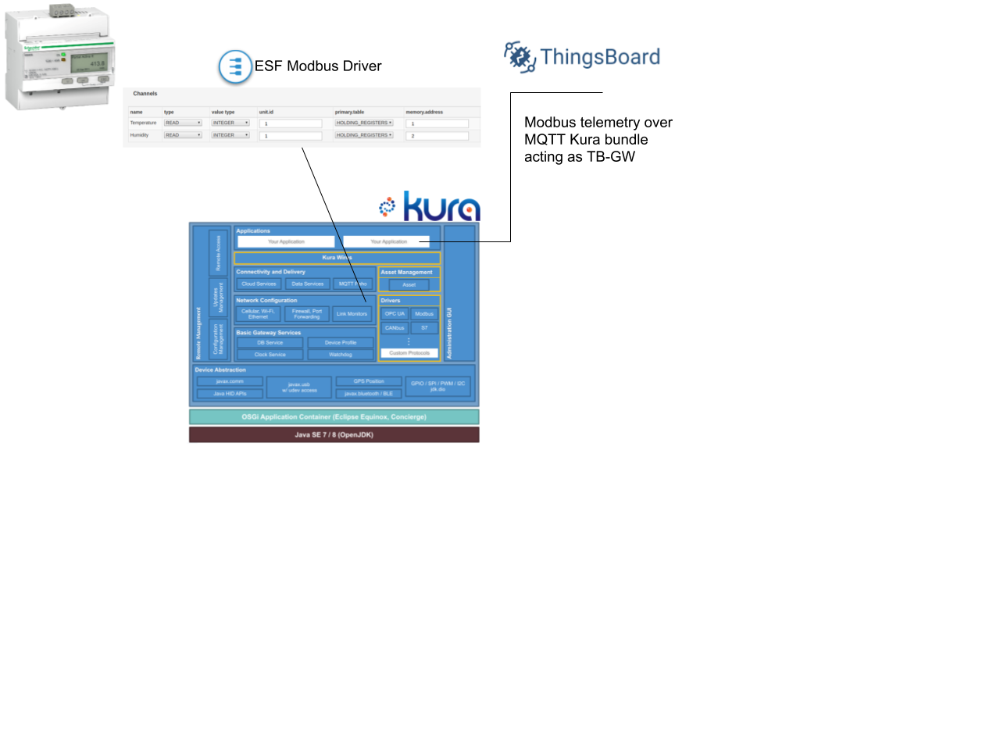
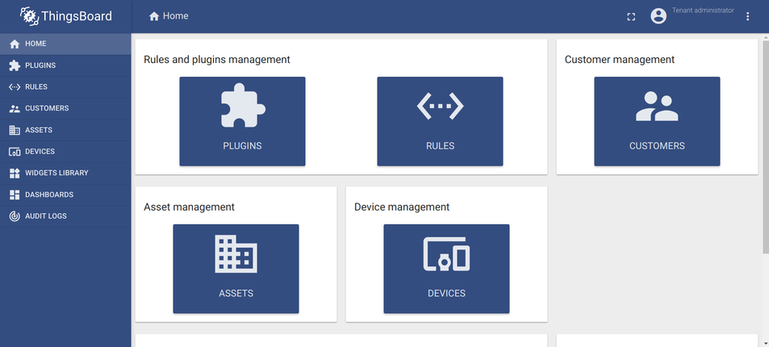
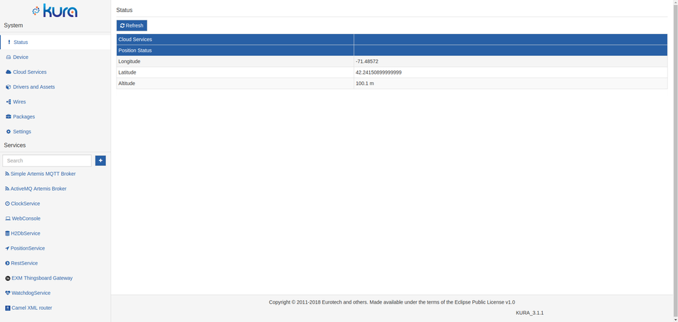
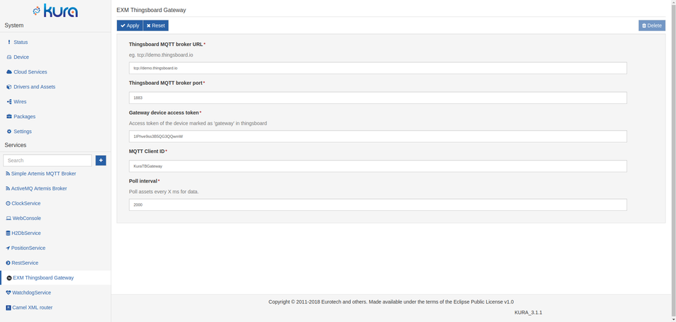
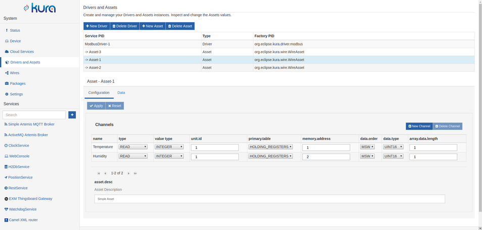
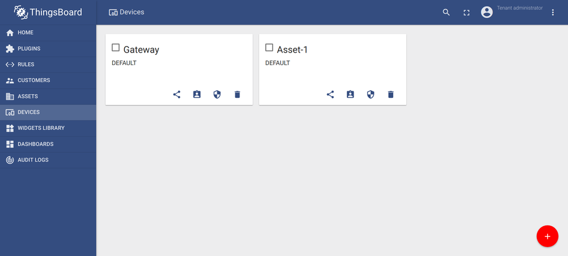
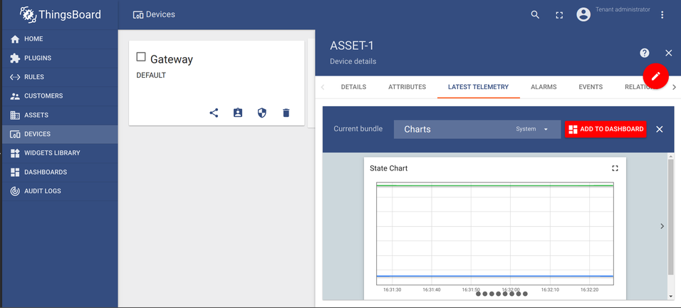
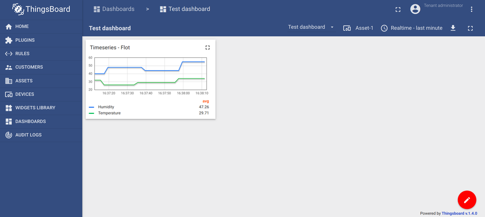

# Kura Thingsboard Bundle

A self contained, configurable eclipse Kura bundle to connect Modbus Devices to the Thingsboard IoT platform.



## Overview

Thingsboard (henceforth "TB") is an open-source platform for collecting, storing and visualizing data from IoT devices. It is a scalable out of the box solution that provides numerous interfaces to easily connect your devices, organize them in a multi-user, multi-tenant, multi-dashboard hierarchy and display collected data in graphical elements (widgets).



Eclipse Kura is a middleware modular gateway software for quick and easy deployment of IoT gateways, even on low power devices such as the Raspberry Pi. Kura is based on an OSGi implementation (Equinox) and provides an easy to use web interface for configuration and deployment of services. A module in Kura is a "bundle", which can act as a container for an IoT app and is fully managed by Kura. A bundle can use any of the services provided by Kura, along with a set of libraries for leveraging the various hardware interfaces provided by the host (usb, gpio etc.).




## Installing the ModBus driver
In order for Kura to be able to access ModBus devices a ModBus driver must be installed. A free for testing purposes driver is available at the Eclipse Kura Marketplace: https://marketplace.eclipse.org/content/esf-modbus-driver . To install it, open the "packages" section in Kura web interface side by side with the Kura Marketplace page, drag the "install" button from the link above and drop it in packages, select "Install" at the prompt if asked. After a few seconds "com.eurotech.modbus.driver" will appear in the list.

## Installing the bundle
The bundle can be installed through Kura’s web ui. Go to “Packages” -> “Install/Upgrade”, select the bundle’s .dp file (provided in this repo) and click “Submit”. If all went well you should see it in the list of packages and in the list of installed configurable services on the bottom left part of the screen.

## Configuring the bundle
This bundle authorizes itself to the Thingsboard MQTT broker by the means of an "access token" that can be obtained from thingsboard in the following steps:

1. Log in to thingsboard
1. Go to devices and click "add new device" (+)
1. Fill in the name and device type and check "Is Gateway", click "Add" to create the device.
1. Open the newly created device and click "Copy access token".

Now open Kura Web UI, and open the "Thingsboard Gateway" configuration page.



Fill all the fields:

* Your Thingsboard installation URI, you can create an account at demo.thingsboard.io for testing. 
* Thingsboard MQTT broker port, 1883 by default.
* Gateway device access token: The token you copied in the previous step.
* MQTT client id: The id by which the gateway will be identified at the broker (can be anything).
* Poll interval: Interval at which the configured slaves are read.

Click apply to save.


## Creating and configuring devices
Now that we installed the ModBus driver, we can create an instance of this driver to which we will add our devices.
In Kura, devices are represented by "Assets" and each object of an Asset (coils, discrete inputs, input registers, holding registers) are represented by "Channels".

Go to "Drivers and Assets" and click "New Driver". Under "driver factory" select the driver you just installed, enter a name under "driver name" and click "Apply". Clicking the newly created instance opens its configuration page below. Since the ModBus configuration is on per-instance basis, you can connect both ModBus-TCP/UDP and ModBus-RTU devices at the same time.

Now let's add your first device. Click "New Assets", enter a name, select the newly created driver instance and click "Apply". The new device appears in the list. Select the device by clicking it, to reveal the "Channels" list. Click "New Channel" to add a new channel, enter a name and click "Add". After adding all your channels and configuring them, click "Apply" themo save. If the configuration is correct and the devices are connected properly, by clicking the "Data" tab Kura reads all the configured channels on this asset and displays their current values.




## Displaying the data in thingboard
Assuming that the bundle and all the devices are configured properly, the devices appear automatically in thingsboard (under “Devices”) right after the first time data is read from their channels and submitted to TB.



Now we can add a graphical element (widget) which will visualize received data. In TB, widgets are organized in dashboards.

1. To create a dashboard, go to “Dashboard” and click (+) “Add new Dashboard” -> “Create new Dashboard”, fill the form and click “Add”.
2. Now go to “Devices”, select a device and click open the “latest telemetry” tab. Here you can see the data received by this device. If the list is empty, either your device hasn’t sent any data yet, or the configuration in the previous steps was done incorrectly.
3. Check all the metrics you want to appear in the widget and click “Show on widget”. In the dropdown that appears, you can see all the types of widgets that TB supports. Select “Charts” and browse to the “Timeseries - Flot” widget (you can browse through available widgets by clicking the little arrows on the left and right side of the popup) and click “Add to dashboard”. 



Finally, select the target dashboard, check “open dashboard” to view the dashboard immediately after adding it, and click “Add”.




## Implementation Details

Kura provides all the libraries and interfaces you need to communicate with other services and the host hardware. As this is an OSGi environment, its a highly modular system that offers its functionality to be used by the developer through various services, while at the same time the inner workings are completely abstracted away.
Such abstraction examples are among others the Drivers, Assets and Channels used in this bundle. The developer need not be aware of the details that make them tick, Kura gives you only what you need to know and hides everything else. This results in a stable system in which components are interoperable and can be started, stopped or removed without affecting its function.
As an example, the ModBus driver installed in the previous steps can be easily exchanged with a different driver (eg. an OPC UA driver) and the components that make use of the driver (eg. Assets)  will keep functioning correctly as its integration to the overall system is completely transparent to the other components.

For Kura to provide the application an interface to a service, the app must request it by including a reference in the component definition xml file and at the same time define bind and unbind functions which will be called by Kura when it’s ready to provide it. In the Kura Thingsboard Gateway bundle we make use of the AssetService to load all the assets added by the user:

Component definition xml:
```xml
	<reference name="AssetService"
          policy="static"
          bind="setAssetService"       
          unbind="unsetAssetService"       
          cardinality="1..1" 
          interface="org.eclipse.kura.asset.AssetService"/>

```

The main class:
```java
public class MyBundle
{

    private static AssetService m_assetService;

    ...

    /** Called by Kura to set the AssetService when loading the bundle*/
    public void setAssetService(AssetService assetService)
    {
        m_assetService = assetService;
    }

    /** Called by Kura to unset the AssetService when unloadng the bundle */
    public void unsetAssetService(AssetService assetService)
    {
        m_assetService = null;
    }
}

```

When Kura loads our bundle, it will provide it with an AssetService object through the setAssetService function as we requested in the component xml file. This object gives us the means to load all available Assets and make read requests on their Channels as demonstrated below:


```java
// Iterate through all loaded assets
for (Asset asset : m_assetService.listAssets())
{
    try
    {
        // Make a read request on all the channels belonging to the asset
        List<ChannelRecord> channelRecords = asset.readAllChannels();

        // Iterate through the data read from each channel
        for (ChannelRecord rec : channelRecords)
        {

            System.out.println("Read: " + rec.getValue().getValue() + " from Channel: " + rec.getChannelName());

        }
    }
    catch (KuraException e)
    {
        AgileGateway.log("Error while reading channels" + e.getMessage());
    }
}
```

As evidenced by this code, we didn’t need to make any driver specific calls, or implement any protocols. All is done through generic API calls on simple interfaces while all the low level details are hidden away. This ensures that this code will work with any protocol compatible with the Assets service, since it is all completely transparent to the developer.

The latest (at the time of writing) version of the Kura API can be found here: http://download.eclipse.org/kura/docs/api/3.1.1/apidocs/